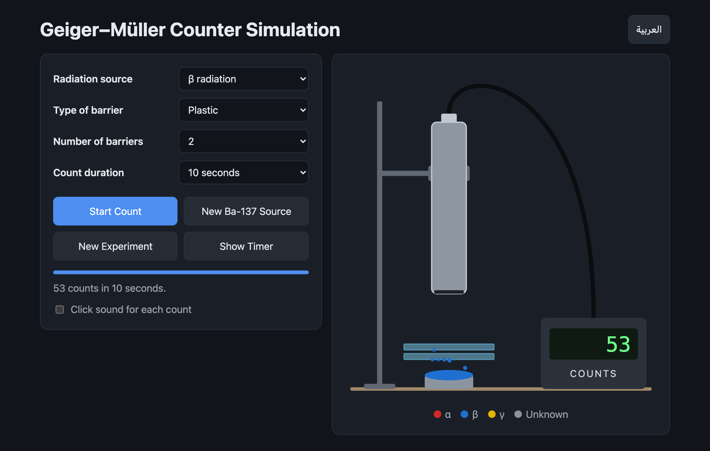

# Geiger–Müller Counter Simulation

A browser-based Geiger–Müller counter lab for studying how alpha, beta and gamma radiation pass through lead, plastic and cardboard barriers.

https://hayderkharrufa.github.io/geiger-muller-counter-simulation/



## Run locally

```sh
python3 -m http.server
```

Open http://localhost:8000.

## Tests

```sh
node --test
```

## License

[MIT](LICENSE)
