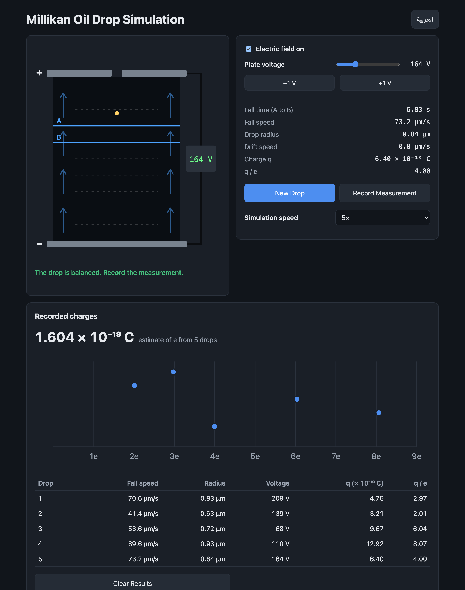

# Millikan Oil Drop Simulation

A browser-based Millikan oil drop experiment: watch a charged oil drop fall between two plates, balance it with the electric field, and measure its charge in multiples of the elementary charge.

https://hayderkharrufa.github.io/millikan-oil-drop-simulation/



## Run locally

```sh
python3 -m http.server
```

Open http://localhost:8000.

## Tests

```sh
node --test
```

## License

[MIT](LICENSE)
